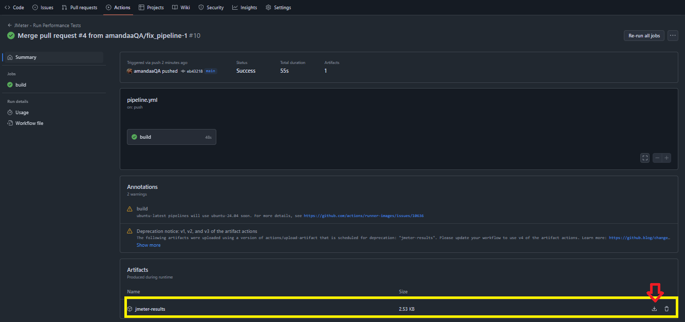

### Performance Testing using Jmeter
Simple performance testing on [Blaze Demo website](https://blazedemo.com/) using [Apache JMeter](https://jmeter.apache.org/), [PerfAction](https://github.com/QAInsights/PerfAction) and Github Actions to automate the Test Execution.

#### Explaining the performance test

Scenario:
Platform: 

### Running the JMeter Test

#### Running with Github Actions

1. Clone the repository;
2. Click on `Actions`;
3. Click on `Run Workflow`;
4. Select the `main branch` and click on `Run Workflow`. The system will start to run your Build;
5. After finish the build execution, you will be able to find the results on the 'summary section';

**Optional:** You can also download the execution reorts on Artifacts section: 




### Running on your own machine 

JMeter allows you to run tests either through its graphical user interface (GUI) for development and debugging, or via the command-line interface (CLI) in non-GUI mode, which is generally preferred for large-scale load tests due to its lower resource consumption.

#### Prerequisites

1. Install Java

    1.1 Java is required for JMeter. 
    
    [Download](https://www.java.com/download/ie_manual.jsp) and install Java version 8 or higher.

2. Install Jmeter

    [Download and install](https://www.java.com/download/ie_manual.jsp) JMeter. It should be installed on the machine that you want run tests

    2.1 Locate the Jmeter executable file for your system on subfolder `bin`

    2.2 Add the Jmeter's executable file to the system enviroment variables. Usually, on Linux and macOS, the executable is `jmeter`and on Windows, the executable is `jmeter.bat`.


##### NON GUI MODE:
1. Clone the repository 

```command 
git clone https://github.com/amandaaQA/JmeterCICD.PerformanceTest_BlazeDemo.git
```
2. Open the `cmd` and run the command: 

```command 
jmeter -f -n -t "performanceTest.jmx" -l log.jtl -e -o "Results"
```
`-n`: this specifies JMeter is to run in non-GUI mode;
`-f`: force JMeter to overwrite any file that is contained on report folder
`-t`: location of your test plan
`-l`: location for a log file
`-e`: inform JMeter to create a report
`-o`: inform Jmeter which is directory to store the report in

#####  Non-GUI mode:
GUI mode is indeed used for creating and visually designing test plans. It's also quite useful for debugging and understanding the test flow.

1. Clone this repository git clone https://github.com/serputko/performance-testing-framework.git

2. Run the Jmeter executable;

3. On JMeter, clck in `open a new file` and select `performanceTest.jmx`

4. open performance-testing-framework dir

5. Open the file performanceTest.jmx and click in RUN